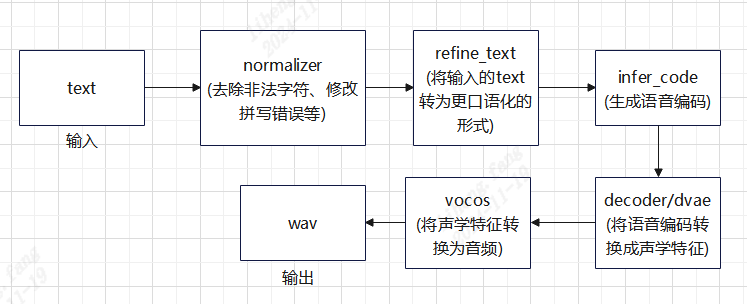

# Python例程

## 目录

- [Python例程](#python例程)
  - [目录](#目录)
  - [1. 环境准备](#1-环境准备)
    - [1.1 x86/arm PCIe平台](#11-x86arm-pcie平台)
    - [1.2 SoC平台](#12-soc平台)
  - [2. 推理测试](#2-推理测试)
    - [2.1 非流式推理](#21-非流式推理)
    - [2.2 流式推理：](#22-流式推理)
    - [2.3 参考音频音色克隆](#23-参考音频音色克隆)
  - [3. 程序流程图](#3-程序流程图)

## 1. 环境准备
### 1.1 x86/arm PCIe平台

如果您在x86/arm平台安装了PCIe加速卡（如SC系列加速卡），并使用它测试本例程，您需要安装libsophon、sophon-opencv、sophon-ffmpeg，具体请参考[x86-pcie平台的开发和运行环境搭建](../../TUTORIAL.md#3-x86-pcie平台的开发和运行环境搭建)或[arm-pcie平台的开发和运行环境搭建](../../TUTORIAL.md#5-arm-pcie平台的开发和运行环境搭建)。

此外您还需要安装其他第三方库：
```bash
python -m pip install -r requirements.txt
```

您还需要安装sophon-sail，由于本例程需要的sophon-sail版本较新，相关功能还未发布，这里暂时提供一个可用的sophon-sail源码，x86/arm PCIe环境可以通过下面的命令下载：
```bash
pip3 install dfss --upgrade #安装dfss依赖
python3 -m dfss --url=open@sophgo.com:sophon-demo/Qwen/sophon-sail.tar.gz
tar xvf sophon-sail.tar.gz
```
参考[sophon-sail编译安装指南](https://doc.sophgo.com/sdk-docs/v24.04.01/docs_latest_release/docs/sophon-sail/docs/zh/html/1_build.html#)编译不包含bmcv,sophon-ffmpeg,sophon-opencv的可被Python3接口调用的Wheel文件。

### 1.2 SoC平台

如果您使用SoC平台（如SE、SM系列边缘设备），并使用它测试本例程，刷机后在`/opt/sophon/`下已经预装了相应的libsophon、sophon-opencv和sophon-ffmpeg运行库包。

此外您还需要安装其他第三方库：
```bash
python -m pip install -r requirements.txt
```
由于本例程需要的sophon-sail版本较新，这里提供一个可用的sophon-sail whl包(限BM1688系列设备)，SoC环境可以通过下面的命令下载：
```bash
pip3 install dfss --upgrade
python3 -m dfss --url=open@sophgo.com:sophon-demo/Qwen/sophon_arm-3.8.0-py3-none-any.whl  #arm soc, py38, for se9
```
如果whl包无法使用，也可以参考上一小节，下载源码自己编译。

## 2. 推理测试

### 2.1 非流式推理

`ChatTTS`是封装好的模块，用户可以基于`ChatTTS`模块做二次开发。在调用之前，需要配置好`ChatTTS/config/config.py`里的`class Path`中相关bmodel的路径。

`test.py`是调用示例，可以直接运行`test.py`：
```bash
cd python
python3 test.py
```
运行完成后会在当前目录下生成`test.wav`。

### 2.2 流式推理：

目标设备上需要有音频输出通道，并安装以下依赖：
```bash
sudo apt-get install libportaudio2
pip3 install sounddevice
```

`test_stream.py`是流式调用实例，可以直接运行：
```bash
cd python
python3 test_stream.py
```
运行过程中会播放声音，运行完成后在当前目录下生成`test_stream.wav`。

### 2.3 参考音频音色克隆

克隆条件是**成对**的：参考音频本身 + 该参考音频的文字转写。少给转写，模型会把参考语音当成
"已经说完"，直接提前 EOS（实测同一段参考：转写留空只出 0~0.6s 无声/半句音频，补上转写后正常出 4.2s）。

```bash
cd python
python3 test_clone.py \
    --ref ../test_data/zh_short_1.wav \
    --ref-text "参考音频里说的原话，必须逐字一致" \
    --text "大家好，这段音频的音色来自参考音频。" \
    --output clone.wav
```

> 板卡（BM1684X，Python 3.8 + sail + torch 2.4.1）已直接跑通完整克隆链。前置：板卡需装
> `vector-quantize-pytorch / vocos / pybase16384 / numba / pydub`，缺 `soundfile` 时先
> `pip3 install soundfile`。参考音频的逐字转写若未知，可先用本仓库 whisper base 识别：
>
> ```bash
> conda run -n sophon-whisper python -c \
>   "import soundfile as sf, whisper; from scipy.signal import resample_poly; \
>    m=whisper.load_model('base'); x,sr=sf.read('ref.wav',dtype='float32'); \
>    x=resample_poly(x,16000,sr) if sr!=16000 else x; \
>    print(m.transcribe(x, language='zh', fp16=False)['text'])"
> ```
>
> 实测（2026-09-03）：zh_short_1.wav 编码 134 codes(~2.9s)，克隆 RTF 1.96(Python/SAIL)；同一 prompt 用
> C++ `--voice-prompt --ref-text` 合成 RTF 0.57，两段输出时长一致证明注入生效。

`--no-clone` 用同一份文本和随机种子再跑一次，作为不克隆的对照：

```bash
python3 test_clone.py --ref ../test_data/zh_short_1.wav --no-clone --output baseline.wav
```

代码调用，`spk_smp` 字符串可以存下来复用，避免每次合成都重新编码参考音频：

```python
spk_smp = chat.load_ref_prompt("ref.wav")            # 3~5s 干净人声
wavs = chat.infer(text, params_infer_code=ChatTTS.Chat.InferCodeParams(
    spk_smp=spk_smp, txt_smp="ref.wav 的逐字转写"))
```

如果还要使用纯 C++ 例程，可在同一次编码时加 `--prompt-out prompt.bin`。该文件只保存
DVAE 音频码，C++ 调用时仍需通过 `--ref-text` 传入对应转写：

```bash
python3 test_clone.py --ref ../test_data/zh_short_1.wav \
    --ref-text "参考音频的逐字转写" --prompt-out prompt.bin
```

相似度客观打分（在有 python 的 x86 机器上跑，不需要 TPU；按文件名配对）：

```bash
pip3 install speechbrain soundfile
python3 eval_speaker_sim.py --ref-dir refs/ --gen-dir gen/ --min 0.60
```

BM1684X 板卡实测（8 个不同内置音色各作一条参考，同一目标句）：

| 条件 | ECAPA cosine |
|---|---|
| 参考音频 ↔ 克隆输出（8 组） | **均值 0.637**，min 0.513 / max 0.741 |
| 参考音频 ↔ 同一个 `spk_emb` 但不克隆 | 0.409 |
| 参考音频 ↔ 默认随机音色 | 0.218 |

即音频码 prompt 的音色传递能力明显强于 768 维 `spk_emb` 通道。性能：克隆首步与不克隆同为
定形 prefill，实测 infer/音频比 RTF 0.87~1.18（不克隆同音色 0.88~0.95，属抖动范围）；
DVAE 编码一段 3~4s 参考音频一次性开销约 0.6s。

限制与注意：

* 参考音频量化出的 prompt 会占用 GPT bmodel 固定的 SEQLEN=1024 预算（约 47 码/秒，
  3~5s 参考约 150~235 码），文本和 `max_new_token` 要留出剩余空间。
* 不要用 `max_sec` 去截长参考：`max_sec` 只是安全上限，截断后转写与音频不再对齐
  （实测截到 2s 会多生成约 3s 冗余尾巴）。要更短的参考就重新选/录一段完整的短句。
* 克隆与 `spk_emb` 注入位置不同，可以同时给，一般只取其一：克隆时 `spk_emb` 留空
  （走 `[empty_spk]`）。
* 多句合成（`split_text=True`）时若没显式给 `spk_smp`，会取第一句的合成结果作 prompt
  并把第一句文本填进 `txt_smp`，用来保证跨句音色一致。
* 任意真实录音要用于生产，需要先过一遍 ASR 拿转写（本仓库 SenseVoice / Whisper / Zipformer
  已在同一平台上移植过，可直接复用）。
* 目前 Python/SAIL 支持直接读取参考音频并编码 prompt；C++ 侧支持加载预计算的音频 prompt（`--voice-prompt` + `--ref-text`），sherpa-onnx 交付路径仍只支持固定音色向量 `spk_emb`。

## 3. 程序流程图


